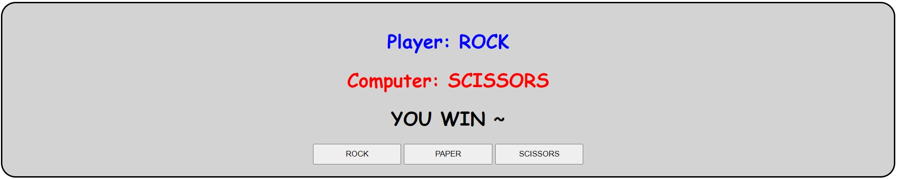

# ROCK PAPER SCISSORS app




Simple game to play rock, paper, scissors vs computer !

Deployed website: https://tonylehuynh-rockpaperscissorsjs.netlify.app/


### **Code explanation**

Use of forEach method to iterate over all the buttons of the choiceBtns class, and then add a "click" event listener to each of them. On the "click" event, the player choice will be set to the text value of the button that they clicked. 

```js
choiceBtns.forEach(button => button.addEventListener("click", () => {
```

The computer's choice is generated using the Math.random() function, where a random number between 1-3 is selected. Based on these random numbers, they are assigned to "ROCK", "PAPER" or "SCISSORS" through using the switch-case statement.

```js
const randNum = Math.floor(Math.random() * 3) + 1;
```


Finally, an if-else statement is used to determine the result of the player vs computer. 
